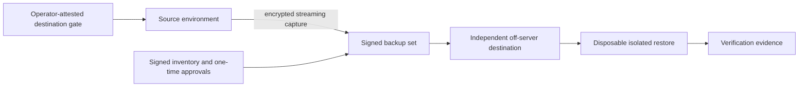

# Secure Staging and Recovery Orchestration

This public showcase documents a security-focused recovery foundation for a live commerce platform. It intentionally contains no production source code, customer data, infrastructure identifiers, credentials, or sensitive operating details.

Version `0.1.2` adds an operator-attested destination-readiness gate to the backup and restore safety foundation. It does not provision external storage, handle provider credentials, or claim that backup, restore, staging, or migration execution has begun.

## What is implemented

- Fail-closed orchestration for encrypted, streaming backups across mixed transactional and non-transactional database workloads.
- Purpose-separated signing identities and narrowly scoped, one-time operational approvals.
- Fresh, privacy-filtered destination-readiness evidence bound to each applicable one-time authorization before recovery provisioning or capture can begin.
- Provider-neutral probe coordination with conditional object creation, bounded independent read-back, exact integrity comparison, narrow cleanup, and replay prevention.
- Signed inventories and evidence that allow backup and restore decisions to be audited without publishing private infrastructure details.
- Disposable, isolated restore validation designed to prove that database and file artifacts are usable together.
- Automated contract, crypto-policy, failure-path, and workflow tests suitable for continuous integration.
- Recovery-oriented state handling so an interrupted finalization can be detected and handled deliberately.
- Durable quarantine state that blocks follow-on operations when temporary database-session cleanup or bounded release cannot be proven.
- Process-identity-bound disposable database cleanup, with signal-safe worker guards and a fresh lock-generation proof that prevents recovery from racing surviving work after abnormal parent exit.
- Redundant deadline supervision and independent release evidence for the brief availability-sensitive database capture window.
- Authentication-before-parsing rules for signed approvals, archived trust, and recovery metadata.
- Least-privilege checks that reject inherited, delegable, or indirect backup permissions.
- Early, independently verified destruction of short-lived decryption material on failure paths.
- Monotonic HTTP containment for one proven legacy sensitive-export exposure, applied without reading the protected payload or broadening the block to unrelated assets.
- Atomic configuration publication with exact pre-change binding, root-only evidence, metadata preservation, idempotency, and fail-closed race and ACL handling.
- A repository-wide privacy gate covering current files, Git history, commit messages, and annotated tags before public publication.

The implementation avoids plaintext backup artifacts and treats incomplete, unverifiable, ambiguously authorized, or process-identity-conflicted states as failures.

## Architecture

Cryptographic roles are separated by purpose. Capture, finalization, and restore validation remain distinct operations, each with explicit evidence and failure boundaries.

The coordinator verifies only observable transport behavior. Physical destination independence and credential isolation remain separately reviewed operator attestations; provider-neutral software does not present them as cryptographic conclusions.

## Scope boundary

The independent staging topology, data-sanitization policy, service sandboxing, and cache/session separation have been reviewed as a design contract. An executable staging builder and sanitizer are not part of this release.

One exact sensitive-export access path was contained and independently verified while storefront and product browsing remained healthy. No customer payload was read, no broad cache flush was used, and orders, users, application data, plugin state, and checkout behavior were unchanged.

The bounded-availability authorization has been recorded. No external destination was configured and no provider credentials were supplied or probed in this release. Production capture remains intentionally blocked until all of the following are available:

- an independently reviewed destination and a fresh successful readiness probe for the applicable phase;
- a green tagged release;
- fresh signed one-time operating material; and
- successful host-readiness checks.

After encrypted capture and independent read-back, a successful disposable restore proof from that destination remains mandatory before staging work can proceed.

## Engineering outcomes

This milestone demonstrates how to turn a high-risk infrastructure change into a reviewable sequence of small gates, including conditional destination checks, one-time authorization binding, and a monotonic emergency control that cannot casually restore an unsafe state. The design favors recoverability, verifiable authorization, minimal secret exposure, and accurate status reporting over premature deployment.

See [CHANGELOG.md](CHANGELOG.md) for release notes and [SECURITY.md](SECURITY.md) for the public disclosure policy.

## Related Portfolio

- Portfolio: https://amiraliyaghouti.com
- Projects: https://amiraliyaghouti.com/projects.html
- Case studies: https://amiraliyaghouti.com/case-studies.html
- GitHub profile: https://github.com/shiny-a2
