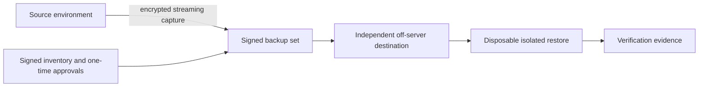

# Secure Staging and Recovery Orchestration

This public showcase documents a security-focused recovery foundation for a live commerce platform. It intentionally contains no production source code, customer data, infrastructure identifiers, credentials, or sensitive operating details.

Version `0.1.0` is an implementation milestone for backup and restore safety. It is not a claim that an independent staging environment has already been built or that production execution has begun.

## What is implemented

- Fail-closed orchestration for encrypted, streaming backups across mixed transactional and non-transactional database workloads.
- Purpose-separated signing identities and narrowly scoped, one-time operational approvals.
- Signed inventories and evidence that allow backup and restore decisions to be audited without publishing private infrastructure details.
- Disposable, isolated restore validation designed to prove that database and file artifacts are usable together.
- Automated contract, crypto-policy, failure-path, and workflow tests suitable for continuous integration.
- Recovery-oriented state handling so an interrupted finalization can be detected and handled deliberately.
- Durable quarantine state that blocks follow-on operations when temporary database-session cleanup or bounded release cannot be proven.
- Process-identity-bound disposable database cleanup, with signal-safe worker guards and a fresh lock-generation proof that prevents recovery from racing surviving work after abnormal parent exit.
- Redundant deadline supervision and independent release evidence for the brief availability-sensitive database capture window.
- Authentication-before-parsing rules for signed approvals, archived trust, and recovery metadata.
- Least-privilege checks that reject inherited, delegable, or indirect backup permissions.
- Early, independently verified destruction of short-lived decryption material on failure paths.
- A repository-wide privacy gate covering current files, Git history, commit messages, and annotated tags before public publication.

The implementation avoids plaintext backup artifacts and treats incomplete, unverifiable, ambiguously authorized, or process-identity-conflicted states as failures.

## Architecture

Cryptographic roles are separated by purpose. Capture, finalization, and restore validation remain distinct operations, each with explicit evidence and failure boundaries.

## Scope boundary

The independent staging topology, data-sanitization policy, service sandboxing, and cache/session separation have been reviewed as a design contract. An executable staging builder and sanitizer are not part of this release.

The production environment remains unchanged. The bounded-availability authorization has been recorded. Production capture remains intentionally blocked until all of the following are available:

- a successfully probed independent off-server backup destination;
- a green tagged release;
- fresh signed one-time operating material; and
- successful host-readiness checks.

After encrypted capture and independent read-back, a successful disposable restore proof from that destination remains mandatory before staging work can proceed.

## Engineering outcomes

This milestone demonstrates how to turn a high-risk infrastructure change into a reviewable sequence of small, reversible gates. The design favors recoverability, verifiable authorization, minimal secret exposure, and accurate status reporting over premature deployment.

See [CHANGELOG.md](CHANGELOG.md) for release notes and [SECURITY.md](SECURITY.md) for the public disclosure policy.
